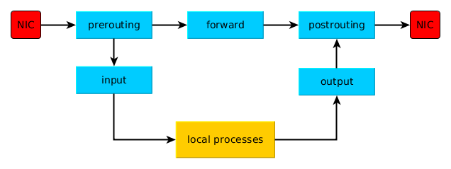

# Using IPTables v1
Supporting files for v1 of my Using iptables Lab Exercises.

# description
This tool was inspired by and borrowed heavily from the PIVOT Challenges, specifically the work of Wilmington University (Eric Arnoth).

# contents
Files included as part of the repository:

- iptables_firewall_project (project plan)
- iptables_network_diagram_v1.pdf (virtual network diagram, created using draw.io)
- Building the Lab on a Windows 10 Host (how-to document on building the virtual lab environment)
- Lab - Using iptables Exercises.docx (iptables exercises)
- rc.iptables.sh (rc script for deployment on the dual-homed host)
- link to .ova file hosted on onedrive

# how to download the .ova file
Click this link https://1drv.ms/u/s!Ahq9EBxMhlUU8dpwF7Wze4ke95nb7g?e=Hg5y48 to download the .ova file (~901MB) containing all three (3) VMs needed for the project.

# supporting procedures
How to import a VM to an appliance:

- Move the exported .ova file to the new host.
- Open VirtualBox.
- Click File | Import Appliance.
- Browse to the .ova file.
- Click Next.
- Review the Appliance settings.
- Click Import.

When the import completes (this process takes significantly less time than exporting), the VM is ready to start up and use.

# resources
The following suppplemental resources may be useful:

- Easy Firewall Generator for IPTables: http://easyfwgen.morizot.net/gen/index.php
